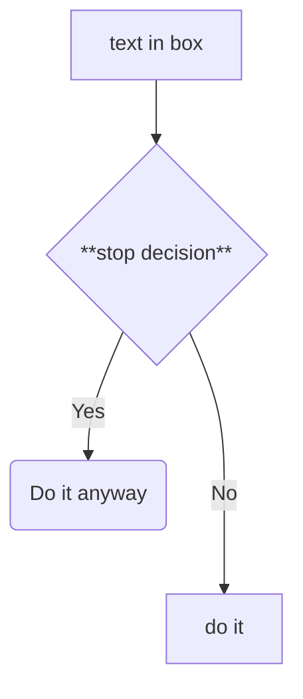
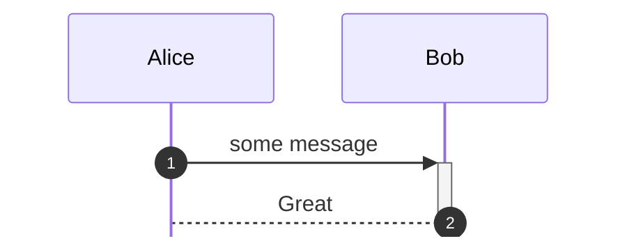
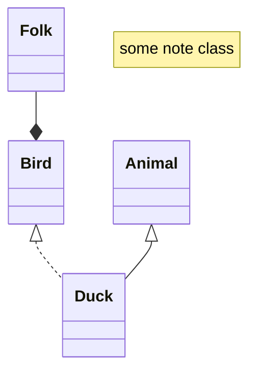
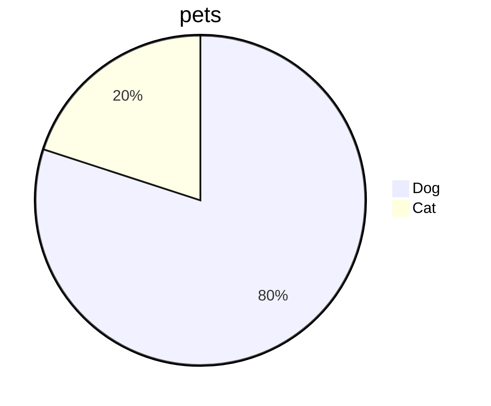
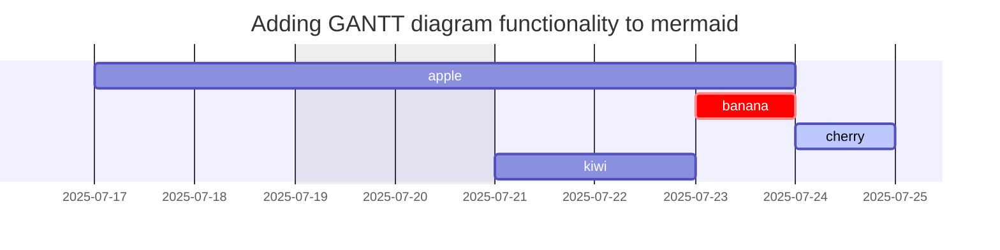

# Context

testing mermaid

mardown prefiew
### Data flow



### Quick sequence diagram
can also use code `%%{init: { 'sequence': {'mirrorActors':false} } }%%` or fontmatter




### Class diagram



### more diagram



### Kanban
Big example

```{.mermaid format=svg}
---
config:
  kanban:
    ticketBaseUrl: 'https://mermaidchart.atlassian.net/browse/#TICKET#'
---
kanban
  Todo
    [Create Documentation]
    docs[Create Blog about the new diagram]
  In Progress
    id6[Create renderer so that it works in all cases. We also add som extra text here for testing purposes. And some more just for the extra flare.]
  Ready for test
    id4[Create parsing tests]@{ ticket: MC-2038, assigned: 'K.Sveidqvist', priority: 'High' }
    id66[last item]@{ priority: 'Very Low', assigned: 'rajan' }
    id3[Weird flickering in Firefox]
  id99[Done]
    id5[define getData]
    id2[Title of diagram is more than 100 chars when user duplicates diagram with 100 char]@{ ticket: MC-2036, priority: 'Very High'}
    id3[Update DB function]@{ ticket: MC-2037, assigned: knsv, priority: 'High' }


```


gantt

